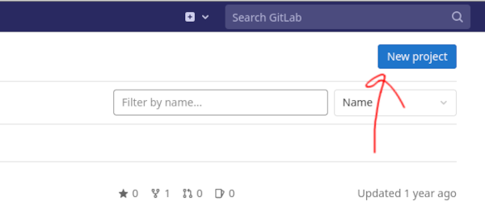
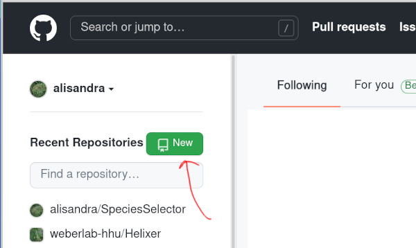

# version-control-intro

A first-timer primer on getting started with git (& github/gitlab).

<!-- toc -->
- [the core functionality (live tutorial)](#the-core-functionality-live-tutorial)
  - [first steps](#first-steps)
    - [make a cloud account](#make-a-cloud-account)
    - [make a repository](#make-a-repository)
    - [install git (+)](#install-git-)
    - [Clone your project (i.e. Download a copy)](#clone-your-project-ie-download-a-copy)
    - [Configure git](#configure-git)
    - [Start tracking your project history](#start-tracking-your-project-history)
    - [Keep synced with the cloud (backup and access anywhere)](#keep-synced-with-the-cloud-backup-and-access-anywhere)
    - [Access your project history](#access-your-project-history)
  - [Misc, but helpful](#misc-but-helpful)
    - [ssh keys](#ssh-keys)
    - [.gitignore](#gitignore)
    - [git help](#git-help)
- [resources](#resources)
- [muscle building (not live tutorial)](#muscle-building-not-live-tutorial)
  - [larger projects and collaboration](#larger-projects-and-collaboration)
    - [branches](#branches)
    - [merge conflicts](#merge-conflicts)
  - [data storage](#data-storage)
  - [keeping it clean](#keeping-it-clean)

<!-- toc -->


## the core functionality (live tutorial)

Git is a very powerful tool, and it can have quite the
learning curve. To keep it as simple as possible, we
will focus on the absolute essentials for you to
get your project in version control and linked to a
cloud repository, i.e. to make your project 'safe'.

### first steps

---

#### make a cloud account

For today, we will use either "git.hhu.de" as our cloud service, because
we (HHU members) all _have_ an account. Or, if you have or what to setup
an account briefly, in the "real world" you'll generally want to use a
cloud service such as "github.com" or "gitlab.com".

---

#### make a repository

We'll do this with our cloud service (easiest), and `clone`
it to our own machine in a minute.

##### git.hhu.de

Click on the blue "new project" button



and then on "blank project"

##### github.com

Click on the green "new" button.



##### Both

Fill in project/repository name and other fields
as desired. In particular, it is normally quite important
to decide if it should be Public/Private. What is private,
can later be made public, but what is once public, will
never truly be private again.

Click on "create project"/"create repository".

The cloud services will _generally_ try and provide
"next step" instructions. These are _generally_ worth
a read, particularly if you're doing something different
from what we will do today (e.g. setting up an _existing_ repository)

---

#### install git (+)

Alright, we have the "remote" or the "cloud service" setup,
now let's setup our local working space

- OsX, Windows: Download and install git from <https://git-scm.com>
- Linux: `sudo apt install git`

##### actually using git

Git itself is a command line tool.
Especially under windows, but optionally elsewhere,
you may want something to help you interface with it / run it.

Options shown in bold will be demoed today.

###### terminal

First of all, any **terminal** or terminal emulator is an option.
So this will work out of the box on linux, mac, and the windows'
linux subsystem. Emulators also come with (probably) _all_ of the
following options.

###### git specific tools

There are tools designed specifically for git.

- git bash <https://www.atlassian.com/git/tutorials/git-bash>
- git desktop <https://desktop.github.com/>

###### integrated development environments

Most IDEs come with git support.

- **Pycharm** <https://www.jetbrains.com/pycharm/>
- **Visual Studio** <https://code.visualstudio.com/>
- ...

> Recommendation: focus on a tool you like. If you already
> use one of the above or another tool with git support,
> use it for git as well. If not,
> pick one (e.g. visual studio or git desktop) and focus on it.
> Complement the intro today with an online tutorial for your
> tool of choice!

---

#### Clone your project (i.e. Download a copy)

Return to the cloud service and
look for a "code" or "clone button", this will
tell us where to download from.


When you click this button, it will give you the option
of "https" or "ssh", if you select the latter (which
you should do _in the long run_ or whenever you start
using github.com for your own projects),
skip ahead to "ssh-keys", and return here once configured.

Otherwise, for git.hhu.de today, just take https.

Now that you've copied the link, run
`git clone <your link here>`
e.g. the final command might look something like
`git clone https://github.com/weberlab-hhu/version-control-intro`
(or navigate to git clone in your software of choice).

---

#### Configure git

You can do this now, or latest when prompted to tell git who you are

```bash
git config --global user.name "Your Name"
git config --global user.email "your_email@example.com"
```

---

#### Start tracking your project history

Congrats, now you have a local copy of your project.

Let's get some work done.

In a text editor of your choice open the `README.md` file,
make some changes, and save them.

##### Look at changes via git

- `git status`  <- hey look, git is keeping track already
- `git diff` <- and it knows what changed

##### Snapshot changes

Many services provide snapshots, git provides snapshots
with _control_ and _documentation_. Part of this control
is organizing what will be committed into the staging area.

- `git add README.md`  <- add to staging
- `git status` <- check what has been added, this becomes more important if
   you ever run `git add *` or similar.

For now, we just have the one file, but you can add as
many things as you want.

- `git commit -m "< your documentation here >"`,
   e.g. `git commit -m "first outline of  introduction"`

The whole documentation part is only as helpful as you make it,
if every commit message (`-m`) says "changed stuff" or "Updated file.txt"
it won't help you search.

Everything that you have "committed" can be restored in the
future. It is "safe" from your supervisor harshly editing your
favorite paragraph, or from breaking your code in the future and
not remembering how it used to be. It is not safe from hard drive
failure, etc.. (yet).

---

#### Keep synced with the cloud (backup and access anywhere)

- `git push` <- sync your snapshots _to_ the cloud

Now open README.md via the cloud service. You can see your local
changes now, right? Click the edit button and make some 'remote'
changes.

- `git pull` <- sync snapshots _from_ the cloud

Now open the local copy of the file and check that the remote
changes are there.

> Recommendation: READ the log messages! If something has
> gone wrong they will probably have ideas on what to do.
> When in doubt: if it won't `push`, try to `pull` first

---

#### Access your project history

Alright, no point in keeping a history of everything
if we don't know how to access it.

In the cloud, there is this nice "History" button,
check it out.

In the terminal:

- `git log` or
- `git log --all --decorate --oneline --graph`

You will want to us the `log` out put to decide _where_ you want to view
the history, and copy the commit hash (the long chain
of numbers and letters, e.g. "3aafb46aa6dd4dd3172bb40783967a76a9e401a4")

##### Roll the whole project and all files back

- `git checkout <hash>`

##### Return the whole project to the latest snapshot

- `git switch main` <- or branch of choice, if you weren't working on main

##### Bring back just one file from the past

- `git restore -s <hash> README.md`

##### OK, I saw what I wanted to, now give me back the current version please

- `git restore -s main README.md`

This gets fancier, but for the start, just know it works. When you have
'checked out' or 'restored' a file from the past, it is a file like any
other. You can copy it elsewhere, or copy some text from it, or just view it.
That's normally enough to give you control, and you dig deeper to make it
elegant as you go.

---

### Misc, but helpful

#### ssh keys

ssh keys are the goto matching lock (public) and key (private) of the
computer world. They can save a lot of typing passwords, and are practically
_necessary_ for putting your own work github.com. They can be very simple
AND they can be very frustrating.

Github already provides instructions:
<https://docs.github.com/en/authentication/connecting-to-github-with-ssh>

For hhu git.hhu.de, it's the same except, navigate to "user settings"/"SSH Keys"
and add it there.

The short version (for linux):

`ssh-keygen`.

> Recommendation: DO NOT change the default location.
> If there is already a key there, cancel generation and
> use the existing key! Also, DO add a password.

Then navigate to ssh-keys somewhere under your
cloud service settings and copy the _public_ (e.g. id_rsa.pub)
key there.

> Another recommendation: keep it simple for starters,
> don't try and access multiple different github accounts
> from the same account on the same computer, until you are
> comfortable with ssh keys.

#### .gitignore

You may have noticed other files 'appearing'
in the working directory (e.g. `.idea`), or you may
have a coding project with a virtual environment.

As a rule, any such auto-generated files should neither
be tracked, nor pushed to remote. It's not just wasting
space, it can cause trouble for anyone who clones a copy.

But if you want to add everything `git add *` is so convenient,
if only it wouldn't grab those.

this is where .gitignore comes in.

- run `git status` to see what isn't tracked, but could be

- Make a file in the base of the repository called .gitignore
and add the names of any files that _shouldn't_ be tracked.
The wildcard `*` works here too.

e.g.

```commandline
.idea
venv*
__pycache__/
```

- run `git status` again to see the difference
- add, commit, and push the `.gitignore` file itself

#### git help

`git help`

that and google.

## resources

A very solid introduction (slightly dated, still all functional)
[here](https://rogerdudler.github.io/git-guide/)

A more extensive look, from basic to advanced features:
[here](https://gitlab.com/jmass/git_crash_course/-/blob/master/git_crash_course.md)

> Recommendation: keep a demo private play ground repository
> to just try things out. That said, as long as you have committed
> and don't _delete the entire repository_ what is deleted can be
> restored, and what is bricked can be checked and patched,
> that's the whole point. So try it out and have fun. :-)

## muscle building (not live tutorial)

Under construction, until then please check
out e.g. the resources above.
Or take the brief descriptions, google some, and roll with it.

### larger projects and collaboration

#### branches

use branches to work on multiple things simultaneously
(be it one person keeping a clean "main" branch while
implementing something in a "feature" branch, or simply
more than one person working together)

`git branch` to make `git switch` to change
`git merge` to combine.

#### merge conflicts

Of course working with multiple instances simulatenously
can cause pain when you go to bring them back together.

What can not be automatically merged, causes a merge conflict
An IDE can help, meld (<https://meldmerge.org/>) can help.

> Note 1: not all that merges automatically is logically
> correct. Unit and integration tests are tools that can
> help here, but that is a whole different topic; so short
> of that, _review_ the differences, and know where you
> expect problems.

> Note 2: make your life easy by not generating completely
> avoidable merge conflicts. Commits are free, so code on your workstation
> with an IDE and `push`, then on the server `pull` and run the code.

### data storage

- small (tiny) example data -> in repository
- moderate project linked data -> lfs <https://git-lfs.github.com/>
- large -> specific repository (e.g. SRA), ARCs?

### keeping it clean

As the project grows, with more people working on it
and / or using it, it can be more important to use
git elegantly, and not end up with a convoluted graph
or a commit for every fixed typo in main.

`git squash` and `git rebase` can help you here

use `git tag` to mark particular snapshots to be
found later (e.g. release versions)
